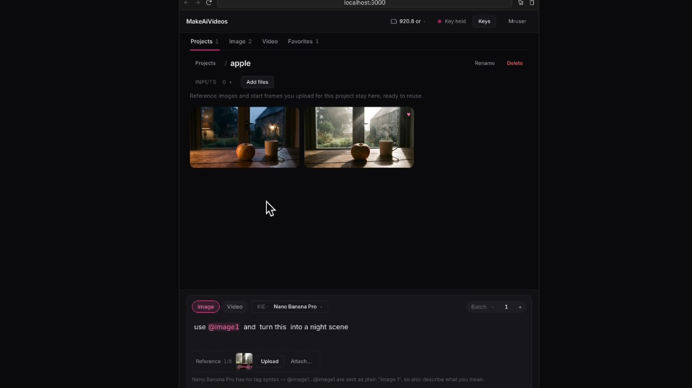
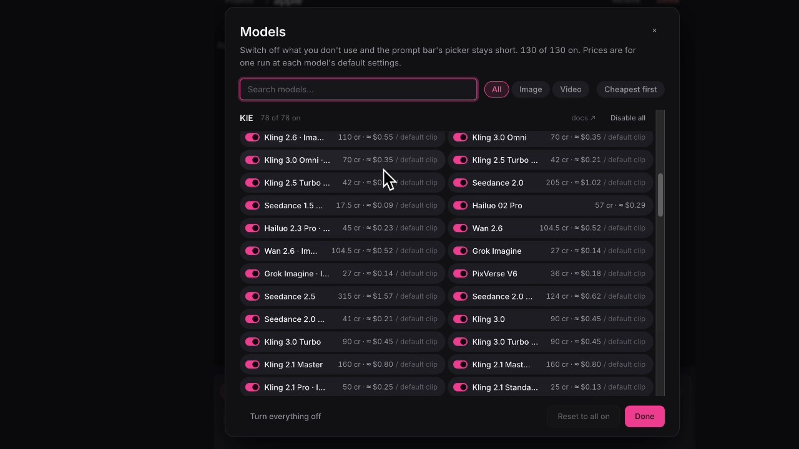

# MakeAiVideos

A self-hosted studio for generating images and videos from one prompt bar,
using your own API keys from KIE, FAL or Higgsfield. Everything lives on the
machine that runs it: accounts, encrypted keys, projects and a local copy of
every result sit in one `data/` folder. No third-party services, no telemetry.

## Watch the setup walkthrough

[](https://youtu.be/fXy1EWDDkSI)

**New here, or not a developer?** Watch the video above, then follow
[START-HERE.md](START-HERE.md) — it walks through the whole setup with Claude
Code, step by step.

## What it looks like


*Your work lives in projects. Attached references get `@image1` tags you can mention in the prompt.*


*130 models with real prices — switch off the ones you don't want in the picker.*

## Quickstart

Requires **Node 20.9+** and **pnpm 10** (`corepack enable` installs it).

```bash
pnpm install
pnpm dev
```

Open http://localhost:3000, then:

1. **Create your account** — the first one is the admin. Nothing is sent anywhere.
2. **Add a provider key** — KIE, FAL or Higgsfield. The app validates it, then
   stores it encrypted on this machine.
3. **New project** — everything you generate is filed in one.
4. **Pick a model, write a prompt, Generate.** The button shows the cost first.

Results land in `data/media/<Project>/`. `pnpm build && pnpm start` for a
long-running install. Any machine with a disk works — laptop, NAS, VPS, Docker —
because the database is a SQLite file. Back up by copying `data/`.

The app is free of running costs; the generations are not. You pay your provider
directly for what you generate.

## Environment

Nothing is required. Copy `.env.example` to `.env.local` only to change a default.

| Variable | Purpose |
| --- | --- |
| `DATA_DIR` | Where the SQLite file, uploads, local media copies and the secret live. Default `./data`. |
| `APP_SECRET` | 64 hex chars used to encrypt provider keys. Generated into `data/secret.key` on first run if unset. |
| `ALLOW_SIGNUP` | `true` lets people other than the first account sign up. Default `false`. |
| `NEXT_PUBLIC_APP_NAME` | Wordmark and page title. Defaults to `MakeAiVideos`. |

Provider keys are entered in the UI (Keys button), validated against the
provider, and stored **encrypted (AES-256-GCM)** in the database. They are
decrypted only inside the server code that calls the provider; the browser
never sees them.

## What's stored where

```
data/
  makeaivideos.db   users, sessions, encrypted keys, projects, generation records, upload records
  secret.key        generated encryption secret (keep it with the database)
  media/<Project>/  a local copy of every generated image / video,
                    named 2026-09-20_1902_<model>_<id>.png
  uploads/<Project>/ files you add to projects (reference images, start frames), original names
  .cache/           downsized previews for the grid — regenerated on demand, safe to delete
```

Folders follow project names (renaming a project renames its folder; moving a
result moves its file). Copy files out freely; deleting or moving them by hand
makes that tile show "file missing" in the app, so do deletes from the app.

Generated files also stay on the provider's CDN for a while; the local copy is
what the app shows, so nothing expires. Passwords are scrypt-hashed; sessions
are httpOnly cookies.

## Layout

```
src/
  app/          layout.tsx, page.tsx, base.css
  design/       tokens.css (design system), components.css (shared primitives)
  providers/    types.ts (the one interface), index.ts (registry), kie/ fal/ higgsfield/
  server/       db.ts (SQLite + schema), auth.ts, crypto.ts, keys.ts, repo.ts, files.ts, paths.ts
  auth/ keys/ data/   server actions the client calls
  generation/   actions.ts (submit / poll / cancel / estimate / completeRun), lifecycle.ts (client run loop), pricing.ts, media.ts
  uploads/      per-provider upload backends (pushing a stored file to KIE / FAL / Higgsfield storage)
  db/types.ts   shared record types
  stores/       zustand: session, ui, keys, projects, library, uploads, prompts, model, prompt, undo
  studio/       composer/, picker/, settings-rail/, gallery/, projects/, viewer/, key-modal/
```

## Scripts

| Command | What |
| --- | --- |
| `pnpm dev` | Dev server on :3000 |
| `pnpm build` / `pnpm start` | Production |
| `pnpm lint` / `pnpm typecheck` | ESLint / `tsc --noEmit` |
| `pnpm test` | Vitest — adapters, pricing, catalog integrity, and the server layer (crypto, accounts, keys, SQLite repo) |

## Choosing which models appear

Account menu → **Models** lists every model grouped by provider and kind, with a toggle each, search, and
enable/disable-all per provider or kind. Everything is on until you switch it off; the set is stored per account
(`settings.disabledModels`), so it follows your login rather than the browser.

## Adding a model

Add one entry to the provider's `catalog.ts` (`src/providers/<provider>/catalog.ts`): id, kind,
declared `settings[]` (the UI renders exactly these), `media[]` roles, `batch`, and a `body()`
that maps the resolved settings into that provider's request. Nothing else changes. Record what you
verified in that provider's `README.md`.

## Status

Milestones 1–4 of 7 done, plus local accounts + SQLite storage. Next: selection/bulk
actions (5), improvements (6), polish (7).
See `BUILD_PROMPT.md` and `SPEC_ADDENDUM.md`.

## Updating

See [UPDATE.md](UPDATE.md). Short version: back up `data/`, `git pull`, `pnpm install`,
`pnpm build`. Migrations run themselves.

## Provider links

The "get a key" and "Recharge" buttons use referral links (`gotolink.cc`). If you
sign up or top up through them the author earns a commission at no extra cost to
you. They are defined in one place per provider — `auth.consoleUrl` and
`auth.rechargeUrl` in `src/providers/<name>/index.ts`. The providers' own sites are
kie.ai, fal.ai and higgsfield.ai.

## Licence

Source-available, not open source. **This first release is free to use** — take a
copy, run it, tell me what breaks. You may modify it for your own use; you may not
redistribute, resell or offer it as a service. A paid version with more features
will follow. See [LICENSE](LICENSE).
